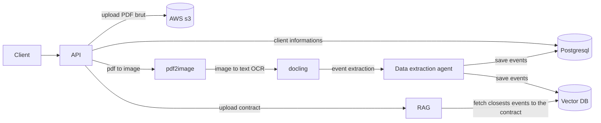
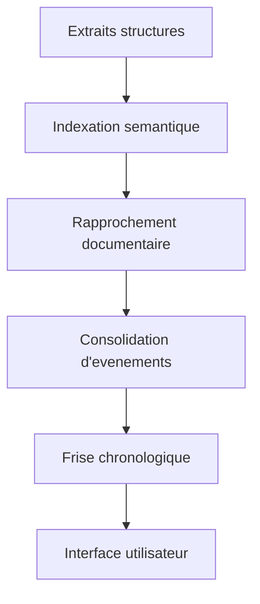

# Tantar

Tantar is an intra-document search tool for jurists, lawyers, and accounting firms.
Its mission: turn complex, heterogeneous legal documents into a reliable, explainable,
and usable legal timeline that retraces the full legal life of a company.

## Case Study - OCR & Legal Document Parsing Pipeline

### Business context
- General Assembly minutes (PV d'AG) are the legal source of truth.
- They are mostly unstructured PDFs, often scanned or partially readable.
- Manual reading is slow, error-prone, and fragments the legal history.

Tantar automatically reads PV d'AG, rebuilds a legal chronology, and links related pieces.

### Role and scope
- Role: Cofounder & Lead Product/Tech
- Period: 2023 - present
- Goal: Extract key legal signals from PDFs, structure reliable events, and deliver a
  verifiable timeline for demanding legal teams.

### Constraints
- Thousands of documents per company, 10,000 to 100,000 pages.
- 1 to 50 years of legal history.
- High explainability: every data point is traceable to document/page/paragraph.
- Acceptable error rate close to 95% (given legal stakes).
- Must scale to thousands of dossiers per day.

### Technical approach

#### 1) Robust document parsing
- Page-by-page OCR for scanned and hybrid PDFs.
- Logical reconstruction (titles, sections, hierarchy).
- Auto-classification by document type (PV d'AG, statutes, resolutions, annexes).

Volumes:
- 50,000 to 100,000 pages OCR'd
- Average OCR time: ~1 second per page

#### 2) Business-oriented structured extraction
- LLM extraction guided by legal schemas.
- Structured outputs: dates, decisions, resolutions, decision bodies, legal references,
  and associated documents.

Quality:
- Critical field completeness: 80-90%
- Human validation without correction: 95%

#### 3) RAG and timeline
- Semantic indexing of structured excerpts and source docs.
- Automatic linking of documents for the same legal event.
- Consolidation into a single, explainable timeline.

Impact:
- Manual reconstruction before Tantar: 50 to 100 hours per dossier
- With Tantar: 10 to 20 minutes
- Time saved: 80-90%

### Pipeline OCR & parsing

### RAG & timeline generation

### Tech stack
- API: FastAPI
- Pipeline & orchestration: RabbitMQ, Kubernetes
- OCR & parsing: Docling, docling-hierarchical-pdf, AWS Textract
- Storage: S3 / MinIO, PostgreSQL
- LLM: classification & extraction (Pydantic-AI, LangChain)
- RAG: semantic indexing and document linking (LanceDB)

### Results
- Scalable, resilient pipeline processing thousands of pages per month.
- Full chain from raw PDF to legally usable timeline.
- 80-90% reduction in reading and synthesis time.
- Measurable improvements in reliability and traceability.

### Next steps
- Add a confidence score per event.
- User feedback loop to improve extraction schemas.
- Human-in-the-loop controls for complex cases.
- Extend to additional document types (mergers, capital ops, restructurings).
